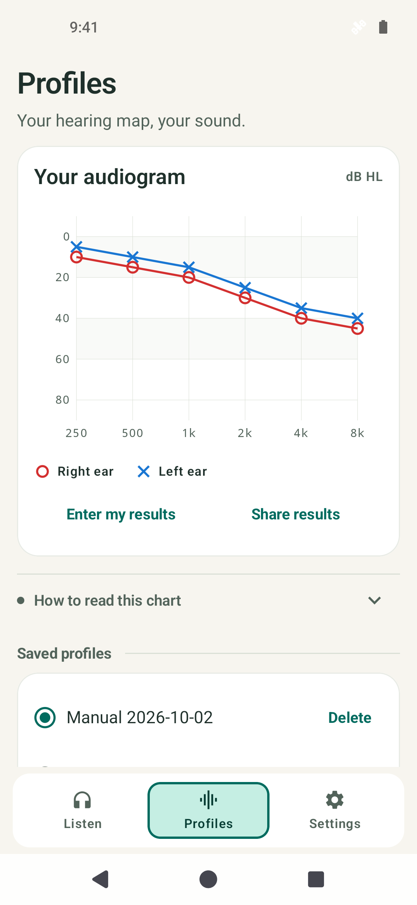
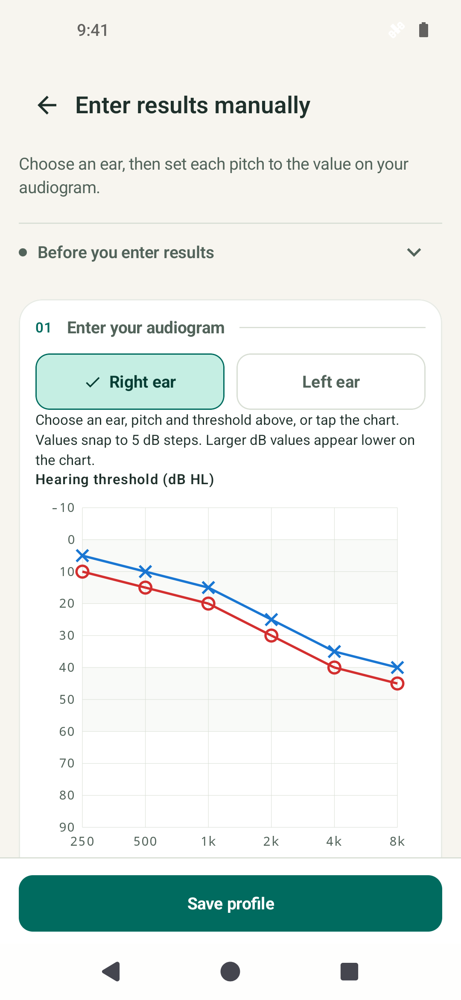
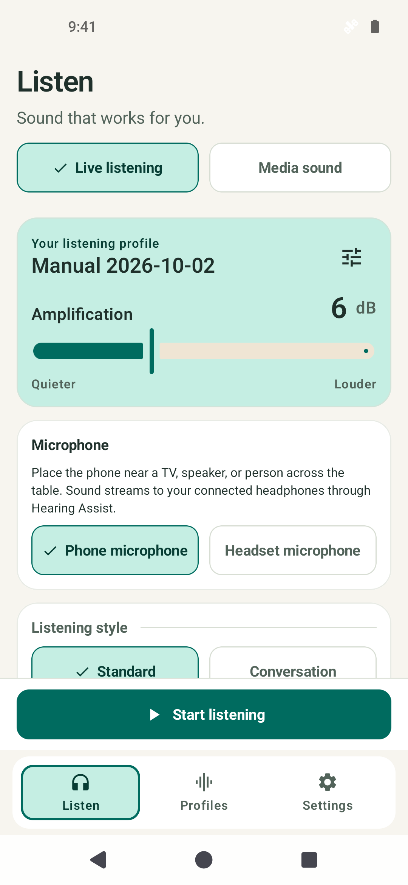
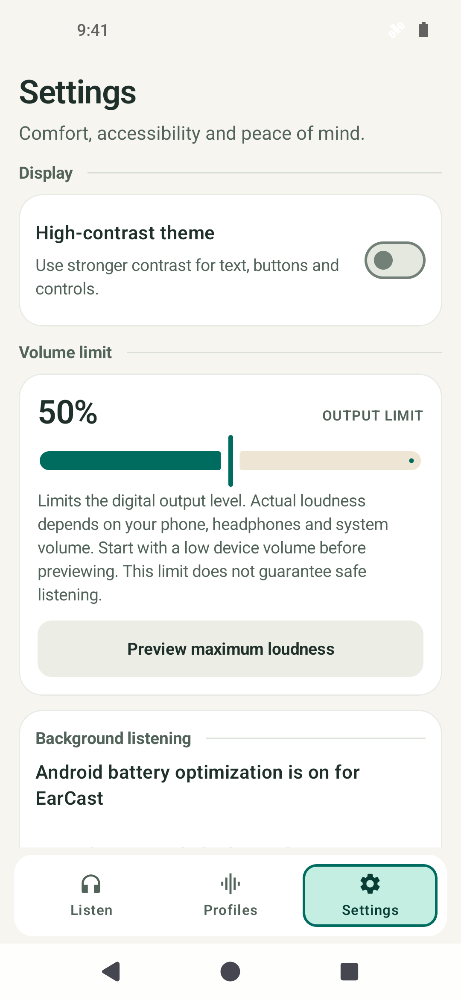

# EarCast

EarCast uses your audiogram to shape the sound you hear through headphones.
Create a hearing profile, adjust each ear on the chart, and use it for live
microphone listening or supported media playback on Android.

EarCast was inspired by [OpenHearing](https://github.com/HMAKT99/OpenHearing).

The app runs on Android 8.0 and newer. Audio processing happens on the phone;
root access and an EarCast account are not required.

## Screenshots

Screenshots from the Android app, using an example audiogram. Select an image to
view it at full size.

| Profiles | Audiogram editor |
| :---: | :---: |
| [](docs/images/screenshots/profiles.png) | [](docs/images/screenshots/audiogram-editor.png) |

| Listening | Settings |
| :---: | :---: |
| [](docs/images/screenshots/listen.png) | [](docs/images/screenshots/settings.png) |

## Start with your audiogram

The **Profiles** tab brings together the hearing check and profile editor.
You can take the guided tone check or enter values from an existing audiogram.
The editor lets you select an ear, change points on the chart, and adjust a
selected frequency with the level slider. Tone previews have a separate stop
control.

Your saved chart appears in Profiles, with separate markers for
left and right ears. Keep multiple profiles, select the one to use for listening,
and preview a results image before sharing it through Android.

Screening with ordinary headphones is uncalibrated. Its displayed thresholds
are estimates, not a clinical measurement. EarCast is not a medical device or a
replacement for a professional hearing assessment.

## Listen with your profile

1. Connect your headphones and accept the first-run safety terms.
2. Open **Profiles** and save a profile from a tone check or manual entry.
3. In **Settings**, set a comfortable output ceiling.
4. Open **Listen**, choose a microphone and listening options, and start assist.
5. Adjust the listening volume as needed. Stop from the listening controls or
   the foreground notification; a quick-settings tile also controls the session.

The phone microphone can pick up a nearby speaker or TV while you listen through
headphones. A supported headset microphone captures sound at the headset instead.
Wired, USB and Bluetooth routes depend on the connected hardware. Classic
Bluetooth call audio is mono and can reduce bandwidth; output-only Bluetooth
devices do not provide a microphone. See the
[microphone routing guide](docs/HEADSET_MICROPHONE.md).

Each ear has its own fitted equalization and compression. Listening options
include environment presets, speech emphasis, feedback suppression, and a
choice of RNNoise, DPDFNet8, SpeexDSP or experimental Adaptive Wiener noise
reduction. Only one noise-reduction engine runs at a time. RNNoise also supports
quiet-speech boost. The output limiters remain active regardless of the selected
engine.

**Media sound**, on Listen, applies the profile to supported music and video
playback through Android audio effects. It offers Balanced and Speech clarity
processing plus a quiet-sound boost. Availability varies by device and player.

Keep volume comfortable and stop if listening feels unpleasant. The digital
output ceiling does not measure sound pressure at your eardrum. Read the
[safety notes](docs/SAFETY.md) and [calibration guide](docs/CALIBRATION.md).

## Free and private

EarCast keeps audiograms and preferences on the device. Live microphone samples
are processed in memory for playback; the app does not record or upload them.
Sharing an audiogram is an explicit action with a preview.

All features are free, including DPDFNet8 and Strong quiet-speech boost.
There are no purchases or paid tiers. All builds contain no advertisements or ad SDK.

Details: [privacy](docs/PRIVACY.md).

## Build and evaluate

The build uses JDK 27 (the latest stable release) and Android SDK 37. Gradle's
runtime version is pinned in `gradle/gradle-daemon-jvm.properties`. Gradle uses
an installed JDK 27 or downloads Eclipse Temurin 27 on Linux (x64/ARM64), macOS
(ARM64) and Windows (x64). The first download requires network access.
`just i` installs a system JDK to launch the wrapper; Gradle then selects JDK 27
for the build, including builds started from Android Studio. Source and bytecode
compatibility stay at Java 17 for Android. Set `sdk.dir` in `local.properties` or
provide `ANDROID_HOME` for your SDK installation.

```bash
./gradlew assembleDebug
just build-prod
./gradlew ktlintCheck detekt test testDebugUnitTest
```

`just build-prod` produces a signed release APK per CPU architecture in
`app/build/outputs/apk/release/`. It uses the configured release key or the local
debug key for device testing. Configure `keystore.properties` before publication.

The repository includes Kotlin checks for profile fitting, processing and route
behavior, plus a native/Python [audio quality workbench](audio-quality/README.md).
The workbench describes how to compare speech engines with prepared recordings.
Automated checks do not establish clinical accuracy or real-world speech
intelligibility. Device routing, latency and listening quality still need
[hardware validation](docs/DEVICE_TESTING.md).

For release packaging and store preparation, use the
[release instructions](docs/RELEASE.md) and
[Google Play checklist](docs/GOOGLE_PLAY.md).

## Find your way through the code

The [implementation guide](ARCHITECTURE.md) follows an audiogram from editing and
storage into a listening session, then describes the capture and playback paths.
The five Gradle modules are `app`, `sound-profile`, `audio-engine`,
`local-storage` and `foundation`. Offline evaluation tools live in `audio-quality`.

EarCast is free and open-source software distributed under [GPL-3.0](LICENSE). Bundled libraries and models
retain their license notices in their respective directories.
