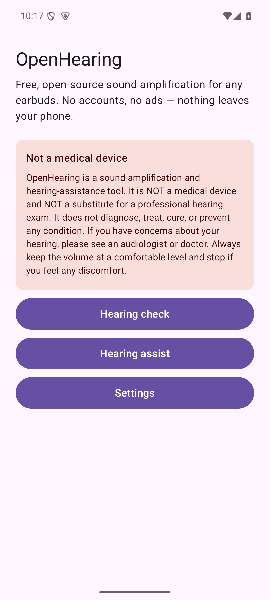
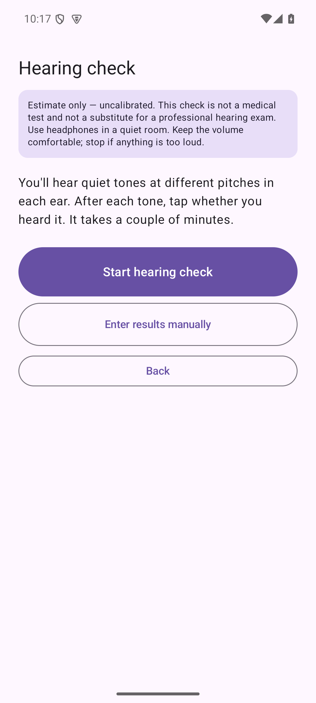
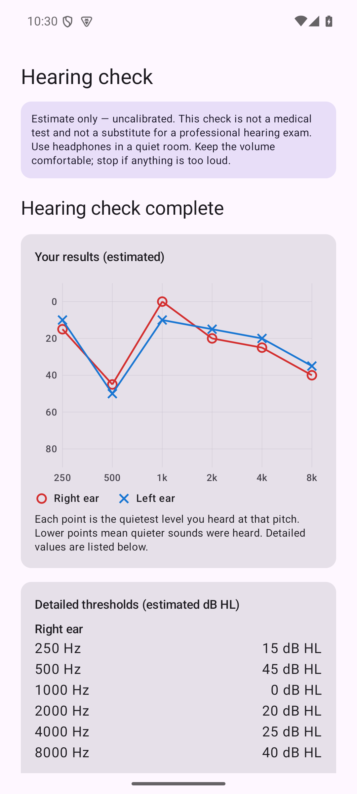
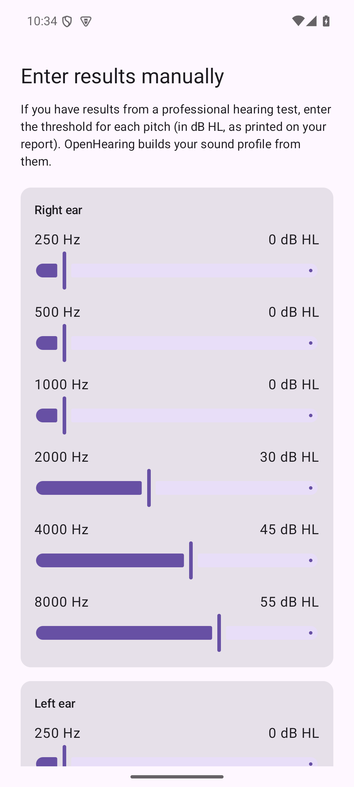
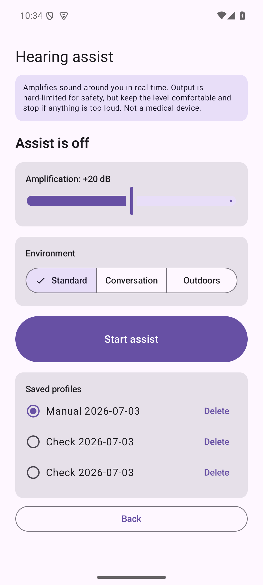
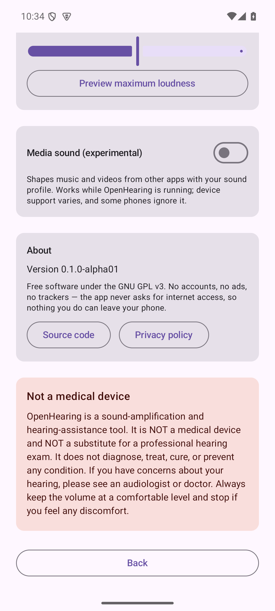

# OpenHearing

**Free, open-source hearing assistance for Android — no root, any earbuds.**

[](https://github.com/HMAKT99/OpenHearing/actions/workflows/ci.yml)
[](LICENSE)
[](https://github.com/HMAKT99/OpenHearing/releases/latest)

Apple ships a hearing screening and a hearing-aid mode on AirPods Pro 2/3 — but
locks them to iPhone/iPad/Mac. OpenHearing brings open hearing assistance to
**Android**, working with **any** earbuds: screen your hearing, build a
personalized amplification profile, and boost quiet speech in real time.

> Complement to [LibrePods](https://github.com/kavishdevar/librepods): LibrePods
> drives AirPods' own hearing-aid mode (root required); OpenHearing does its own
> on-device processing — **no root, any earbuds.**

---

## ⚠️ Important: this is not a medical device

> **OpenHearing is a sound-amplification and hearing-assistance tool. It is NOT a
> medical device, NOT a certified hearing aid, and NOT a substitute for a
> professional hearing exam.** It does not diagnose or treat any condition. If you
> have concerns about your hearing, see an audiologist or doctor. Keep the volume
> comfortable and stop if anything is too loud.

---

## Screenshots

<table>
  <tr>
    <td></td>
    <td></td>
    <td></td>
  </tr>
  <tr>
    <td align="center"><b>Home</b></td>
    <td align="center"><b>Hearing check</b><br/>heard / not-heard, with volume cap + stop</td>
    <td align="center"><b>Results</b><br/>per-ear chart + suggested amplification</td>
  </tr>
  <tr>
    <td></td>
    <td></td>
    <td></td>
  </tr>
  <tr>
    <td align="center"><b>Manual entry</b><br/>type in results from a professional test</td>
    <td align="center"><b>Hearing assist</b><br/>live volume, presets, saved profiles</td>
    <td align="center"><b>Settings</b><br/>comfort calibration, media EQ, high contrast</td>
  </tr>
</table>

> Screenshots are from the running app on an emulator (the check values shown are
> from an automated test pass). ▶️ A real demo video is coming after on-device
> validation.

---

## Features

- 🎧 **Pure-tone hearing check** — adaptive (Hughson–Westlake) staircase, per ear,
  per frequency, shown as a per-ear chart — or **enter results from a professional
  hearing test manually**.
- 📤 **Shareable results** — export your results chart as a clean image via a
  preview-first dialog, so you always see exactly what you're sharing before it
  leaves the app.
- 🔊 **Real-time hearing assist, per ear** — each ear gets its own fitted gain
  curve (stereo), with wide dynamic-range compression, a feedback/howl guard, and
  **live volume control while it runs**.
- 🎤 **Phone or headset microphone** — choose the input in Hearing assist;
  place the phone next to a TV or across the table to use it as a remote mic.
- 🎭 **Hear the difference** — play a sample sound and flip between the original
  and the version shaped through your profile, mid-playback.
- ⏱️ **Listening meter** — a relative gauge of how loud and how long assist has
  been running, with a gentle reminder to take a break.
- 🎚️ **Environment presets** — standard / conversation / outdoors, plus multiple
  saved profiles you can switch between, and a quick-settings tile for one-tap
  on/off.
- 🎵 **Experimental media EQ** — apply your sound profile to music and videos from
  other apps (device support varies).
- 🛡️ **Safety first** — a hard look-ahead output limiter (extensively tested),
  comfort calibration to cap loudness, an always-available instant **Stop**, and
  automatic stop if your headphones disconnect.
- ♿ **Accessibility-first** — large controls, high-contrast theme, scalable text.
- 🔒 **Private by design** — no accounts, no analytics, no ads, no network access.
  Audio is processed on the phone, streamed only to/from your connected headset,
  and never recorded or uploaded.
- 🎧 **Any earbuds** — wired or Bluetooth; AirPods support is a future enhancement.

---

## How to use

**Microphone input:** In Hearing assist, choose **Phone microphone** to place the
phone near a TV, speaker, or person across the table and stream that sound to your
headphones. Choose **Headset microphone** to capture sound at your headset and
play it back through the same headset. Wired/USB microphones and Bluetooth
two-way call audio are supported through Android's routing APIs; output-only
Bluetooth devices cannot supply microphone audio. Classic Bluetooth uses mono
call audio. Device compatibility and latency need hardware validation.
See [setup, compatibility, and testing](docs/HEADSET_MICROPHONE.md).

1. **Install** — grab the APK from
   [Releases](https://github.com/HMAKT99/OpenHearing/releases/latest) (or add this
   repo to [Obtainium](https://github.com/ImranR98/Obtainium) for auto-updates;
   F-Droid submission in progress).
2. **Read & accept** the safety disclaimer on first launch.
3. **Take the hearing check** — put on a headset in a quiet room, tap
   **Hearing check → Start**. After each tone, tap **Yes, I heard it** or
   **No, I didn't**. The volume cap and **Stop / mute** are always on screen.
   Already have results from a professional test? Use **Enter results manually**
   instead.
4. **Review your results** — a per-ear chart plus the suggested amplification
   (half-gain rule). Each check is saved as a dated profile, so you can keep a
   history and switch between profiles.
5. **Turn on Hearing assist** — grant microphone access, choose the **Phone
   microphone** or **Headset microphone**, pick an environment preset, and tap
   **Start assist**. Sound is amplified per ear in real time; adjust the volume
   live, and tap **Stop assist** any time (or use the quick-settings tile).
6. **Calibrate comfort** (Settings) — preview the maximum loudness and lower it
   until comfortable; that caps how loud assist mode can ever get. The optional
   **media EQ** (experimental) and high-contrast theme live here too.

See [docs/SAFETY.md](docs/SAFETY.md), [docs/CALIBRATION.md](docs/CALIBRATION.md),
and [docs/DEVICE_TESTING.md](docs/DEVICE_TESTING.md) for details.

---

## Privacy

Privacy is **platform-enforced, not just promised**: OpenHearing declares **no
`INTERNET` permission**, so it physically cannot make network calls. Your hearing
data and profile stay on the device. Microphone audio is processed in real time
and streamed locally between the phone and your connected headset; it is
**never recorded or uploaded**.

- **No accounts, no ads, no analytics, no trackers, no network.**
- Dependencies are AndroidX / Compose / Hilt / Kotlin only — no Google Play
  Services, Firebase, or ad/analytics SDKs.

Verify it yourself from the APK:

```bash
aapt dump permissions OpenHearing-<version>.apk
```

The only permissions are `RECORD_AUDIO` (the mic for assist mode),
`FOREGROUND_SERVICE` + `FOREGROUND_SERVICE_MICROPHONE` (to keep assist running with
a visible notification), `POST_NOTIFICATIONS`, and `MODIFY_AUDIO_SETTINGS` (required
by Android for audio routing and the optional media EQ effect), and `WAKE_LOCK`
(screen-off listening). See [docs/PRIVACY.md](docs/PRIVACY.md).

---

## Build from source

**Requirements:** JDK 17, Android SDK (API 35, build-tools 35.0.0). Point the build
at your SDK via `local.properties` (`sdk.dir=...`) or `ANDROID_HOME`.

```bash
./gradlew ktlintCheck detekt test testDebugUnitTest   # lint + unit tests
./gradlew assembleDebug                                # debug APK
```

CI runs the same checks on every push/PR. Release/signing steps are in
[docs/RELEASE.md](docs/RELEASE.md).

---

## Project status — what's verified vs. not

Early **alpha**: the full software pipeline (screen → profile → real-time assist)
is built and unit-tested, but **not yet validated on real hardware.**

| Area | Status |
|---|---|
| Audiogram screening engine (staircase, fitting) | ✅ pure-Kotlin, unit-tested |
| Real-time assist DSP (EQ + WDRC + feedback guard + limiter) | ✅ unit-tested; limiter safety suite is the release gate |
| Android audio engine + foreground assist service | ✅ builds — **needs on-device validation** |
| Onboarding, persistence, assist UI, accessibility | ✅ |
| Comfort calibration + output ceiling | ✅ (true dB SPL calibration needs a meter) |
| Signed release build, privacy, F-Droid metadata | ✅ — [docs/RELEASE.md](docs/RELEASE.md) |
| AirPods Pro 2/3 detection / transparency routing | ❓ **UNVERIFIED** — [docs/PROTOCOL.md](docs/PROTOCOL.md) |

**On AirPods:** the protocol is reverse-engineered, not public; we build on
[LibrePods](https://github.com/kavishdevar/librepods)/CAPod. It may not be fully
controllable from Android without root/firmware access — which is why OpenHearing
works fully on **any** earbuds first.

---

## Architecture

Clean multi-module Kotlin (Compose/Material 3, MVVM, Hilt, coroutines). DSP and
safety logic live in pure-Kotlin modules so they're unit-tested with no emulator.
See [ARCHITECTURE.md](ARCHITECTURE.md).

`:app` · `:core-common` (units + safety constants) · `:core-audiogram` (screening
+ fitting) · `:core-audio` (DSP + limiter) · `:airpods-protocol` (UNVERIFIED) ·
`:data` (persistence).

---

## Contributing

Contributions welcome — especially **hardware testers** (AirPods Pro 2/3 + an
Android phone) and accessibility feedback. See [CONTRIBUTING.md](CONTRIBUTING.md),
[CODE_OF_CONDUCT.md](CODE_OF_CONDUCT.md), and [docs/SAFETY.md](docs/SAFETY.md).

## License

**GPLv3** — see [LICENSE](LICENSE).

## Credits

- [LibrePods](https://github.com/kavishdevar/librepods) and CAPod for the AirPods
  reverse-engineering groundwork.

> OpenHearing is an independent project, not affiliated with or endorsed by Apple.
> "AirPods" is a trademark of Apple Inc., used only to describe hardware compatibility.
